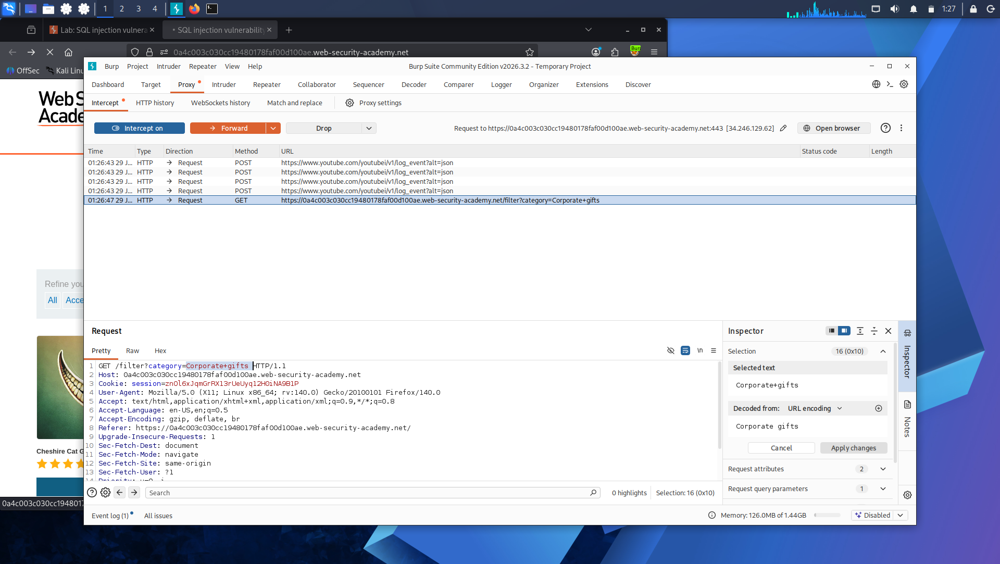
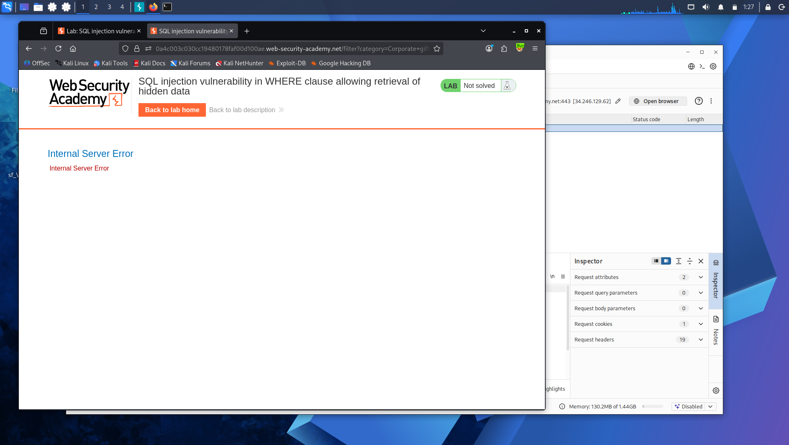
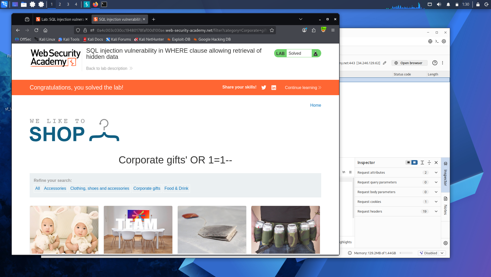

# Lab 1: SQL Injection in WHERE Clause — Retrieving Hidden Data

**Platform:** PortSwigger Web Security Academy

## What's going on here

This lab has a product page where you can filter by category — Gifts, Electronics, that kind of thing. Behind the scenes, when you pick a category, the app runs a query that looks something like this:

```sql
SELECT * FROM products WHERE category = 'Gifts' AND released = 1
```

That `released = 1` part is doing quiet work — it's making sure only products the store actually wants to show get returned. Unreleased products stay hidden. The problem is, if the app just takes whatever you type into the category field and drops it straight into that query without checking it, you're not just choosing a category anymore — you're writing part of the SQL yourself.

## Finding the injection point

The category gets passed through the URL like this:

GET /filter?category=Gifts




Nothing unusual yet — this is just how the app is supposed to work.

## Testing if it's actually vulnerable

The first thing I did was throw a single quote on the end of the category value:

GET /filter?category=Gifts'


If the app were handling input safely, this should just get treated as a weird category name and return nothing. Instead, it threw a database error.



That error is the tell. It means my quote broke out of the string the app was expecting, and the database choked on the leftover syntax. In other words — I'm now inside the query, not just filling in a form field.

## Turning that into an actual bypass

Once I knew the input wasn't sanitized, the next move was to make the query return everything, regardless of category or release status. The payload:

GET /filter?category=Gifts' OR 1=1--


Here's what that does to the original query:

```sql
SELECT * FROM products WHERE category = 'Gifts' OR 1=1--' AND released = 1
```

`OR 1=1` is always true, so the WHERE clause no longer actually filters anything — every row matches. And `--` comments out the rest of the line, so `AND released = 1` never even gets evaluated. The release check just disappears.



## What happened

The response came back with the unreleased product included — something a normal user was never supposed to see. The injection worked exactly as intended: it didn't just add data to the query, it rewrote its logic.

## Takeaway
Unsanitized input let user data rewrite the query's logic. Parameterized queries fix this by always treating input as data, never as SQL.

---

This adventure was okay, but the levels of excitement are only going up from here. 
<br>Next up: **[Lab 2 — SQL Injection Vulnerability Allowing Login Bypass](lab-2-login-bypass.md)**.


