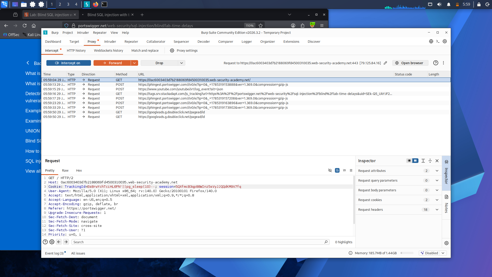

# Lab 14: Blind SQL Injection with Time Delays

**Platform:** PortSwigger Web Security Academy

## What's going on here

This is the last resort of blind SQLi — when there's no visible message, no error, no status code difference, nothing at all to read from the response. If the response itself gives away zero signal, the only thing left to measure is time. Make the database pause on purpose, and how long the server takes to answer becomes the channel.

## 🎯 Target

Confirm time-based blind injection is possible by making the server visibly delay its response.

## The bypass

Modified the `TrackingId` cookie to:

TrackingId=x'||pg_sleep(10)--

`pg_sleep(10)` is a PostgreSQL function that does exactly what it says — pauses execution for the given number of seconds. Tacking it onto the injection point with `||` (string concatenation, same trick used back in the Oracle labs) forces the database to sit idle for 10 seconds before it can return anything at all.

Sent the request and watched the clock.

## Result

The response took 10 seconds to come back — proof that arbitrary SQL was executing inside the query, even with zero visible output, zero error, and zero content difference to inspect.

## Takeaway

Time is the last channel that's always available, no matter how well an app hides its errors or scrubs its responses — a deliberate delay either happens or it doesn't, and that alone is enough to confirm injection. It's also the slowest technique in this whole path: useful as a last resort, but painful at scale compared to conditional responses or errors.

---

A 10-second pause proved the injection works. Next: turning that same delay into an actual data-extraction channel — making the *length* of the delay depend on the data itself: **[Lab 15 — Blind SQL Injection with Time Delays and Information Retrieval](lab-15-time-delay-extraction.md)**.
