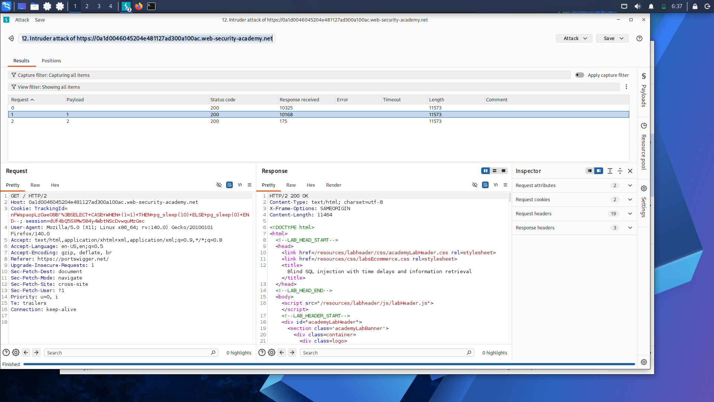
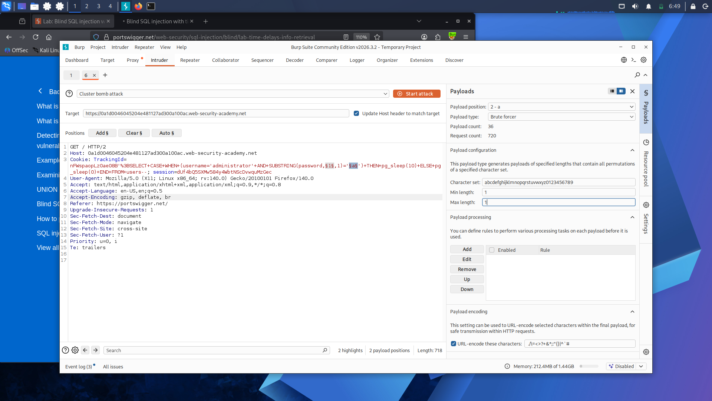
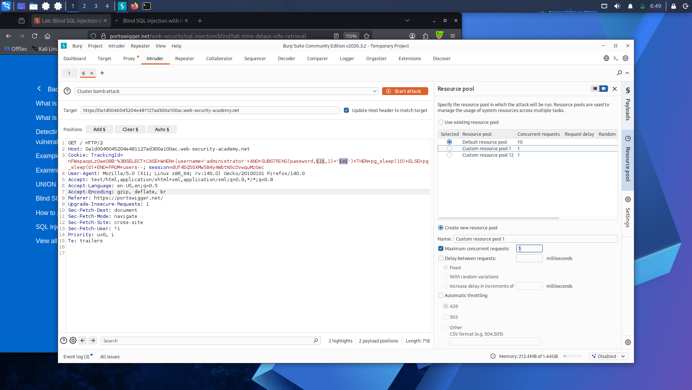

# Lab 15: Blind SQL Injection with Time Delays and Information Retrieval

**Platform:** PortSwigger Web Security Academy

## What's going on here

Lab 14 proved a delay was possible at all. This one turns that same delay into an actual extraction channel — instead of always sleeping for a fixed time, the sleep only fires when a specific condition is true. A 10-second wait means "true," an instant response means "false." Same true/false extraction logic as Labs 10 and 12, just measured in milliseconds instead of a message or a status code.

## 🎯 Target

Extract the administrator's password using response timing as the only signal.

## The bypass

**Confirming conditional delay works:**

TrackingId=x'%3BSELECT+CASE+WHEN+(1=1)+THEN+pg_sleep(10)+ELSE+pg_sleep(0)+END--

10-second delay — condition true.

TrackingId=x'%3BSELECT+CASE+WHEN+(1=2)+THEN+pg_sleep(10)+ELSE+pg_sleep(0)+END--

Instant response — condition false.

**Confirming the target and finding password length**, same as the earlier blind labs — confirmed `administrator` exists, then tested `LENGTH(password)>N` for increasing `N` manually in Repeater, watching for the delay to stop firing. Landed on 20 characters.

**Extracting the password — Cluster Bomb + brute force again, same approach as Labs 10 and 12:**

TrackingId=x'%3BSELECT+CASE+WHEN+(username='administrator'+AND+SUBSTRING(password,1,1)='§a§')+THEN+pg_sleep(10)+ELSE+pg_sleep(0)+END+FROM+users--

- **Position 1** — offsets `1` through `20`
- **Position 2** — lowercase letters and digits

One key difference from the earlier Intruder attacks: this one has to run **single-threaded**. Timing attacks fall apart under concurrency — overlapping requests distort how long each individual response actually took, so the resource pool was capped at 1 concurrent request to keep the measurements clean.

Read the results by the **response time column** instead of a grep match or status code — one payload per offset came back around 10,000ms while everything else returned near-instantly. Those slow rows reconstructed the password one character at a time.

## Result

Extracted the full password purely from response timing, then logged in as administrator.

## Takeaway

Timing is the most universal blind channel — it doesn't depend on any visible content, error, or status code, which makes it the fallback when everything else is locked down. The tradeoff is speed and reliability: single-threading to keep timing accurate, plus the delay itself, makes this by far the slowest technique in the whole path.

---

Every blind technique in this path has relied on the app responding eventually — a message, an error, a delay, something. What happens when the response gives nothing back at all, and the only way to know an injection worked is if the vulnerable server reaches out on its own: **[Lab 16 — Blind SQL Injection with Out-of-Band Interaction](lab-16-oob-interaction.md)**.

