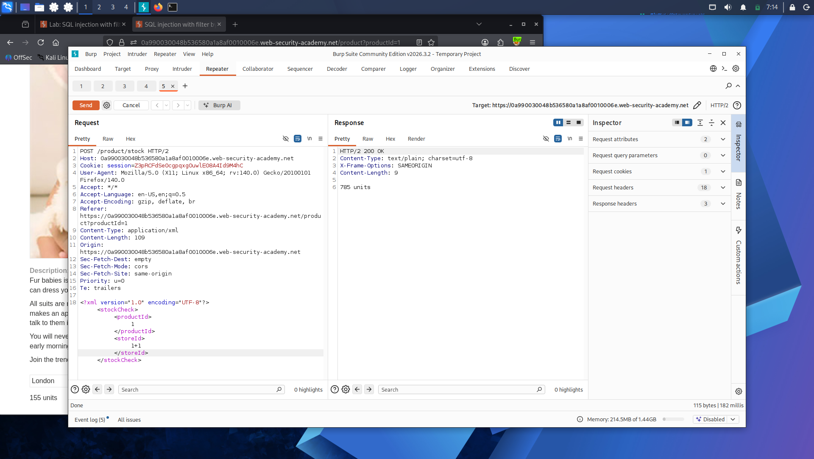
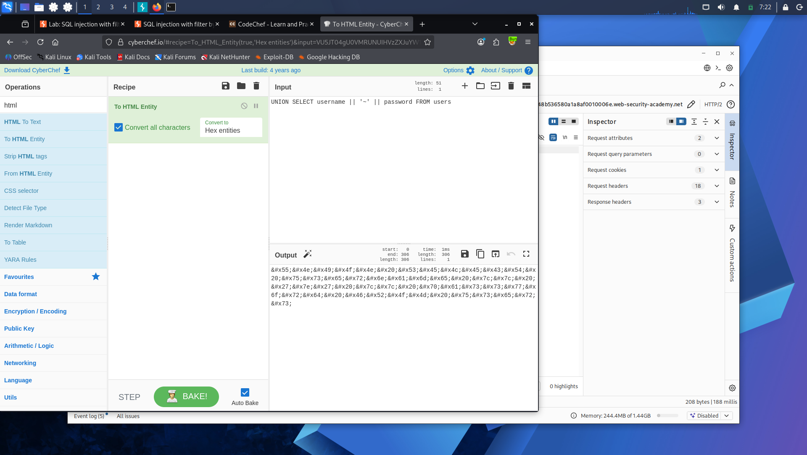
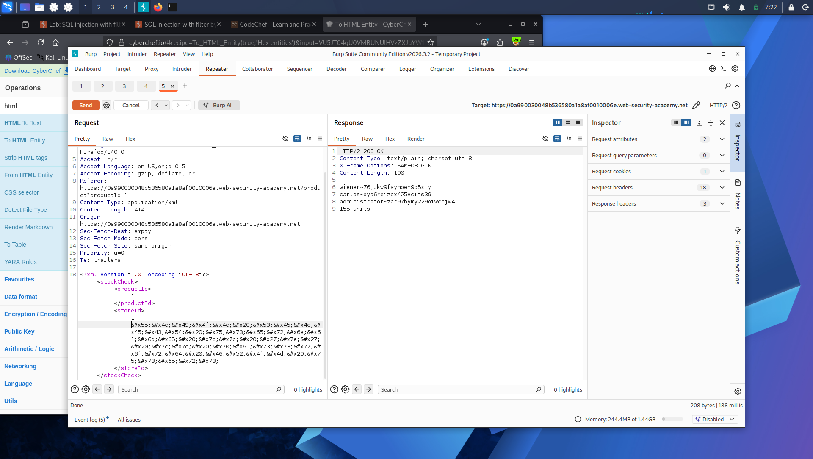

# Lab 18: SQL Injection with Filter Bypass via XML Encoding

**Platform:** PortSwigger Web Security Academy

## What's going on here

This one adds a layer on top of everything before it: a WAF actively blocking obvious injection attempts. The vulnerability's the same UNION-based SQLi from earlier labs — the real challenge is getting the payload past a filter without it looking like an attack.

## 🎯 Target

Bypass the WAF and extract usernames and passwords from a query embedded in an XML request body.

## The bypass

**Confirming the injection point:**

The stock check feature sends `productId` and `storeId` as XML. Sent the request to Repeater and probed `storeId` with a basic math expression:

```xml
<storeId>1+1</storeId>
```



The app returned stock for a different store — confirming the value was being evaluated, not just matched literally.

**Hitting the WAF:**

```xml
<storeId>1 UNION SELECT NULL</storeId>
```

Blocked outright — flagged as a potential attack before it even reached the query logic.

**Bypassing the WAF with XML entity encoding:**

Used the Hackvertor extension to encode the payload as XML entities (`dec_entities`/`hex_entities`) instead of sending it as plain text:

```xml
<storeId><@hex_entities>1 UNION SELECT NULL</@hex_entities></storeId>
```



The WAF was pattern-matching on the raw SQL keywords in the request — encoding the payload as XML entities hides those keywords from the filter's view, while the XML parser on the server side still decodes and executes it exactly as intended. The filter and the parser aren't looking at the data the same way, and that gap is the bypass.

**Determining column count and crafting the final exploit:**

Testing showed the query only returns a single column — anything beyond that just returned `0 units`. So instead of separate columns, concatenated username and password into one string:

```xml
<storeId><@hex_entities>1 UNION SELECT username || '~' || password FROM users</@hex_entities></storeId>
```



## Result

The response returned every username and password pair, separated by `~`. Logged in as `administrator` with the extracted credentials.

## Takeaway

Filters that block on literal keyword matching are only as strong as their blind spots — if the underlying parser can decode something the filter never inspects (here, XML entities), the filter is trivially bypassed while the payload still executes exactly as written. Encoding-based bypasses are a recurring theme in real-world WAF evasion, not just a lab trick.

---

And that's the adventure, wrapped. Eighteen doors, eighteen different ways in — a single quote that broke a filter, a UNION that walked out with usernames and passwords, blind guesses turned into certainty one bit at a time, a database that phoned home without saying a word, and finally, a WAF that never saw it coming.

The database gave up everything it had. Turns out it never stood a chance.
