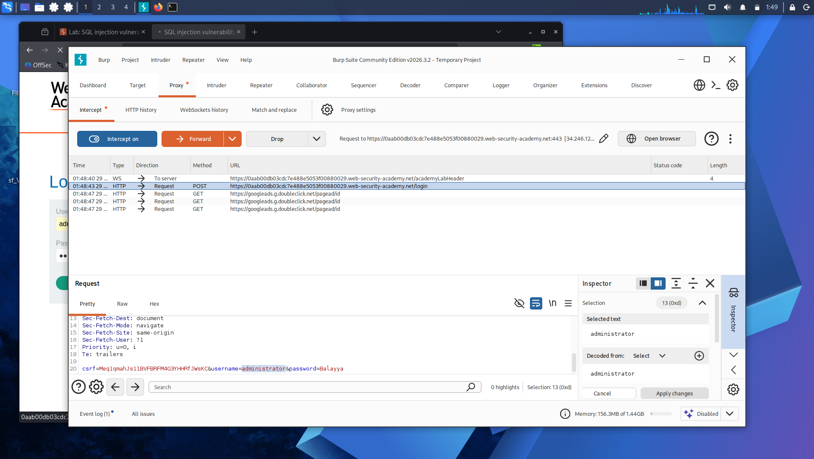
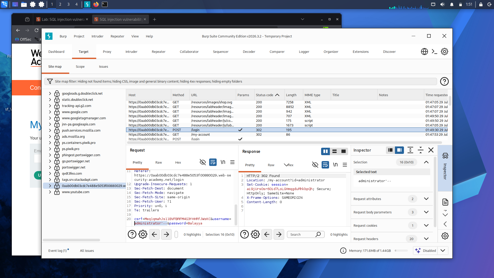

# Lab 2: SQL Injection Vulnerability Allowing Login Bypass

**Platform:** PortSwigger Web Security Academy

## What's going on here

This one's a login form — username and password, nothing unusual. Behind the scenes, the app is almost certainly checking credentials with a query shaped like this:

```sql
SELECT * FROM users WHERE username = 'wiener' AND password = 'peter'
```

Both fields have to match for the login to succeed. But if the `username` field isn't sanitized, the same trick from Lab 1 applies here too — except this time, instead of unlocking hidden products, it unlocks someone else's account.

## 🎯 Target

Log in as the `administrator` user without knowing their password.

## Finding the injection point

Fired up Burp Suite, turned on intercept, and submitted the login form so I could grab and modify the raw request before it reached the server.



## The bypass

Instead of a normal username, I set the `username` parameter to:

administrator'--


Here's what that does to the query:

```sql
SELECT * FROM users WHERE username = 'administrator'--' AND password = 'anything'
```

The `--` comments out everything after it — including the entire password check. As far as the database is concerned, the query is just:

```sql
SELECT * FROM users WHERE username = 'administrator'
```

No password required. If a user with that username exists, the login succeeds.

## Result

Logged in as `administrator` with zero knowledge of the actual password.



## Takeaway

Same root cause as Lab 1 — unsanitized input reshaping the query — but this time on an authentication check instead of a data filter. It's a good reminder that this class of bug isn't confined to search boxes and filters; anywhere user input touches a SQL query is a potential way in, including the gates meant to keep people out.

---

Lab 1 cracked a vault of hidden products. Lab 2 walked straight through the front door as the admin. Next up, things get less "walk in" and more "figure out the shape of the whole query blind": **[Lab 3 — SQL Injection UNION Attack, Determining the Number of Columns Returned by the Query](lab-3-union-column-count.md)**.


