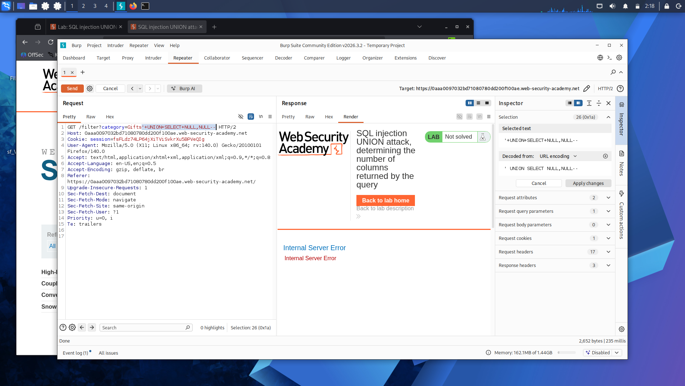
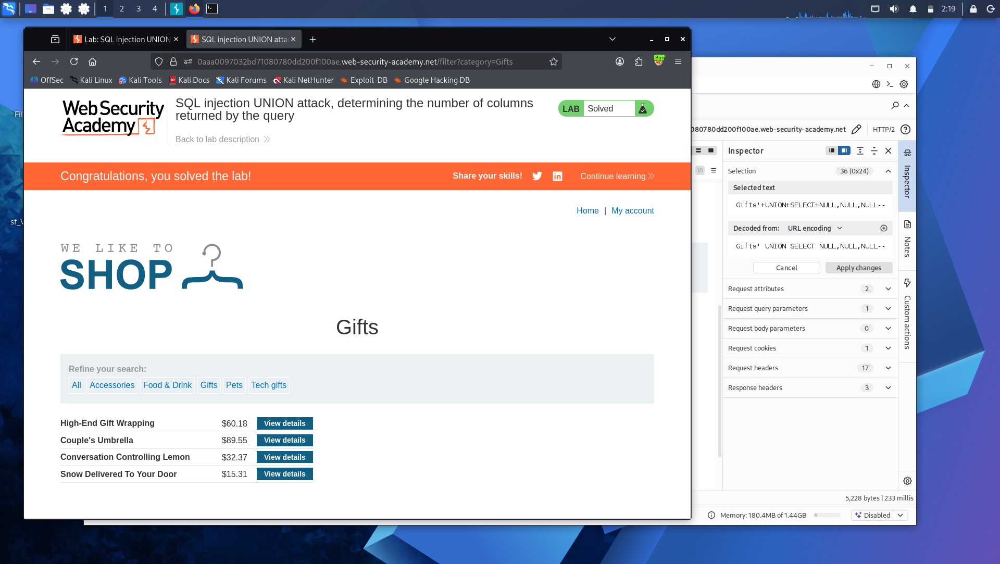

# Lab 3: SQL Injection UNION Attack — Determining the Number of Columns

**Platform:** PortSwigger Web Security Academy

## What's going on here

`UNION` attacks let you combine the results of the original query with a query of your own — which means you can pull data from tables you were never supposed to see. But there's a catch: for a `UNION SELECT` to work, both queries need to return the exact same number of columns. Before extracting anything useful, you first have to figure out how many columns the original query is actually returning.

## 🎯 Target

Find the number of columns returned by the product category query.

## The bypass

Using Burp Suite to intercept the category filter request, I started with one `NULL` column:

'+UNION+SELECT+NULL--

This threw an error — the column counts didn't match.

So I kept adding `NULL` values, one at a time:

'+UNION+SELECT+NULL,NULL--

Still an error. Kept going until the error disappeared and the response actually included extra content made up of those `NULL` values — that's the signal the column count finally matched.

'+UNION+SELECT+NULL,NULL,NULL--

`NULL` is used here specifically because it's valid in (almost) any column type — strings, numbers, dates — so it won't throw a type-mismatch error even before the column count is right. It isolates exactly one variable: how many columns, not what type.

## Result

The error stopped once the right number of `NULL`s was reached, confirming the query's column count — the foundation needed before extracting real data via UNION.

## Takeaway

Determining column count is the boring-but-necessary first step of every UNION attack. Get it wrong and every later injection attempt just throws errors, no matter how good the payload is.

---

Column count: figured out. Next step is finding out *which* of those columns can actually hold text, so real data can be smuggled out through it: **[Lab 4 — SQL Injection UNION Attack, Finding a Column Containing Text](lab-4-union-text-column.md)**.
