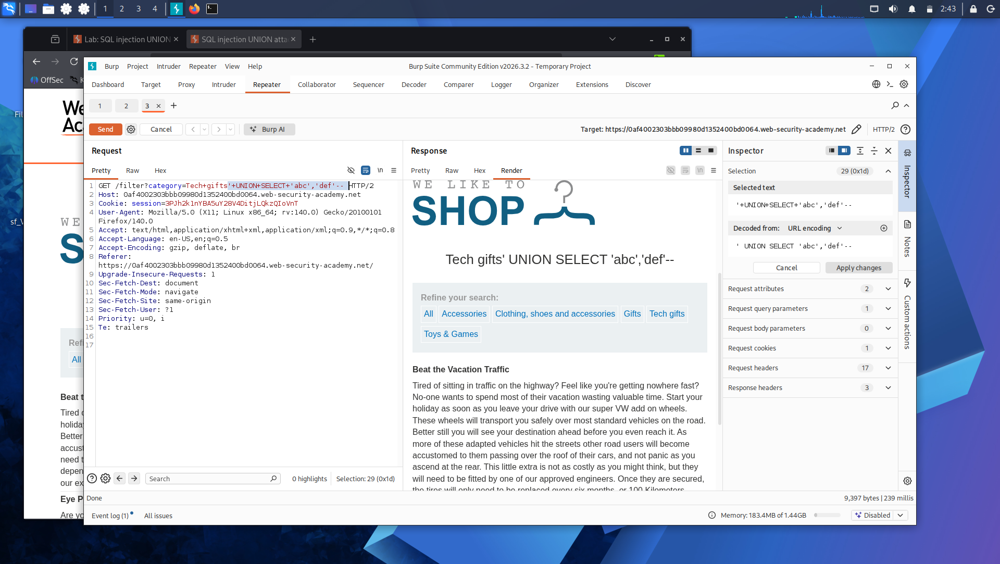
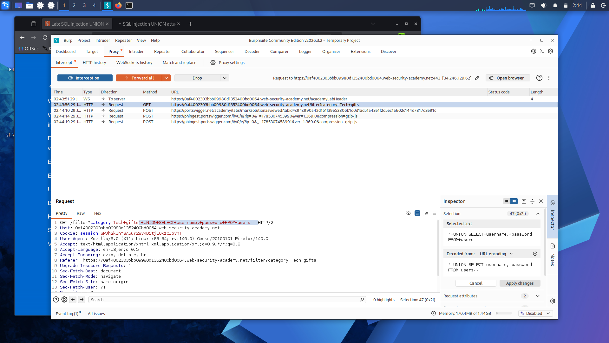
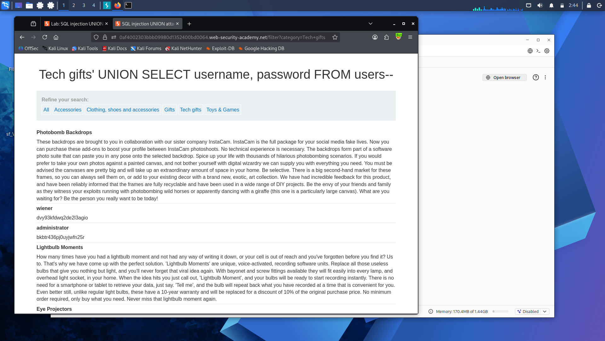

# Lab 6: SQL Injection UNION Attack — Retrieving Data from Other Tables

**Platform:** PortSwigger Web Security Academy

## What's going on here

Everything so far — column count, finding a text column — was setup. This is where it pays off: using UNION to pull real data out of a table the app was never designed to expose, straight into the response you already control.

## 🎯 Target

Retrieve usernames and passwords from the `users` table.

## The bypass

First, confirmed the column layout for this lab: two columns total, only one of which holds text.

'+UNION+SELECT+NULL,'abc'--

With that confirmed, swapped the placeholder for a real query against the `users` table — pulling `username` and `password` concatenated together into that single text column, separated by `~` so they'd be easy to tell apart in the response:

'+UNION+SELECT+NULL,username||'~'||password+FROM+users--

`||` is string concatenation — it's how two separate column values (`username` and `password`) get squeezed into the one column slot that actually renders as text on the page.

## Result

The response came back listing usernames and passwords straight from the `users` table, each pair separated by `~`.

## Takeaway

This is the actual payoff of a UNION attack — not just proving the injection exists, but using it to walk out with real credentials from a table that was never meant to be reachable through this query. Column count and text-column discovery aren't busywork; they're the reconnaissance that makes this step possible.

---

Credentials: extracted. The database itself hasn't given up its identity yet, though — time to find out exactly what we're dealing with: **[Lab 7 — SQL Injection Attack, Querying the Database Type and Version on Oracle](lab-7-oracle-version.md)**.

