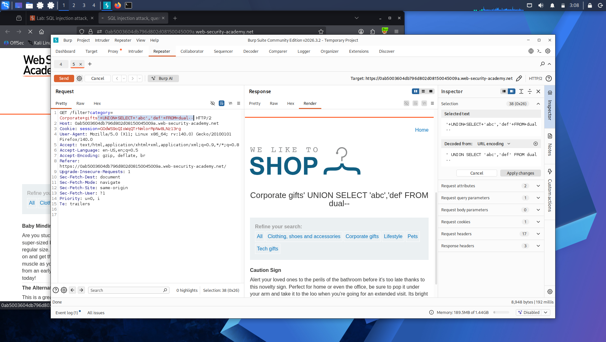
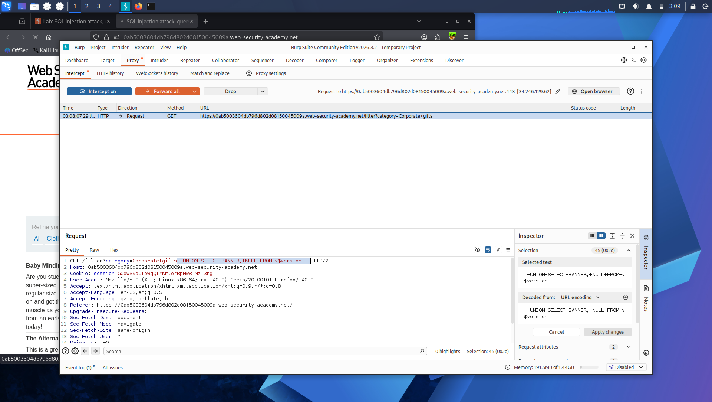
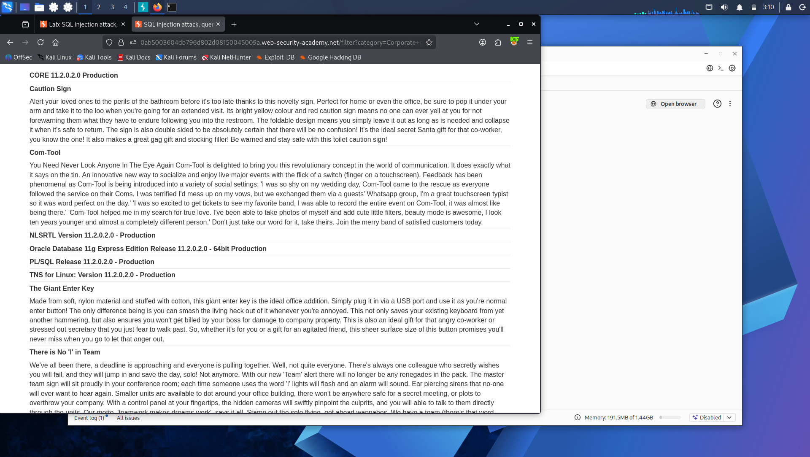

# Lab 8: SQL Injection Attack — Querying the Database Type and Version on MySQL and Microsoft

**Platform:** PortSwigger Web Security Academy

## What's going on here

Same goal as Lab 6 — fingerprint the database — but a different engine entirely. MySQL and Microsoft SQL Server don't use Oracle's `dual` table or its comment syntax, so the payload shape changes even though the underlying idea is identical.

## 🎯 Target

Retrieve the database version string from a MySQL or Microsoft SQL Server backend.

## The bypass

First, confirmed the column layout: two columns, both text-capable.

'+UNION+SELECT+'abc','def'#

Two things are different here versus Oracle. There's no `dual` table needed — MySQL and Microsoft SQL Server both allow a bare `SELECT` with no `FROM` clause at all. And the comment marker changed from `--` to `#`, which is MySQL's native line-comment syntax.

With the column layout confirmed, pulled the version using the database's own built-in variable:

'+UNION+SELECT+@@version,+NULL#

`@@version` is a system variable both MySQL and Microsoft SQL Server expose by default — no special table lookup required, just reference it directly in the SELECT.

## Result

The response returned the full version string for the database engine.

## Takeaway

Every database engine answers "what are you running?" a little differently — Oracle needs `v$version` and `dual`, MySQL/MSSQL just expose `@@version` directly. Knowing these variants by engine is what makes fingerprinting fast once injection's confirmed, instead of guessing syntax blind.

---

Version confirmed. Now that the database's identity is known, it's time to stop asking about the engine and start asking about everything it's storing: **[Lab 9 — SQL Injection Attack, Listing the Database Contents on Non-Oracle Databases](lab-9-listing-contents.md)**.
